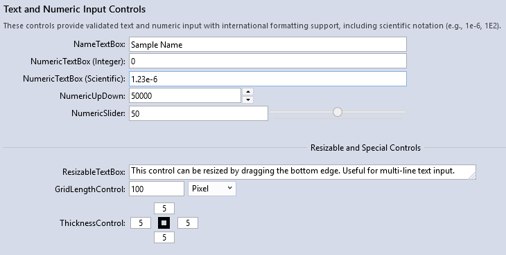
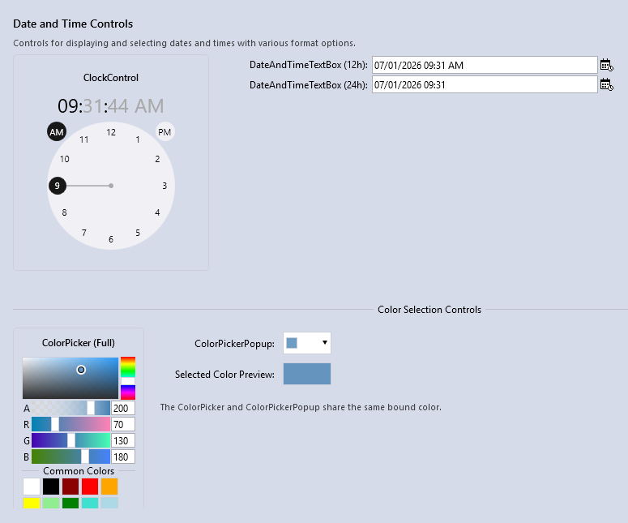
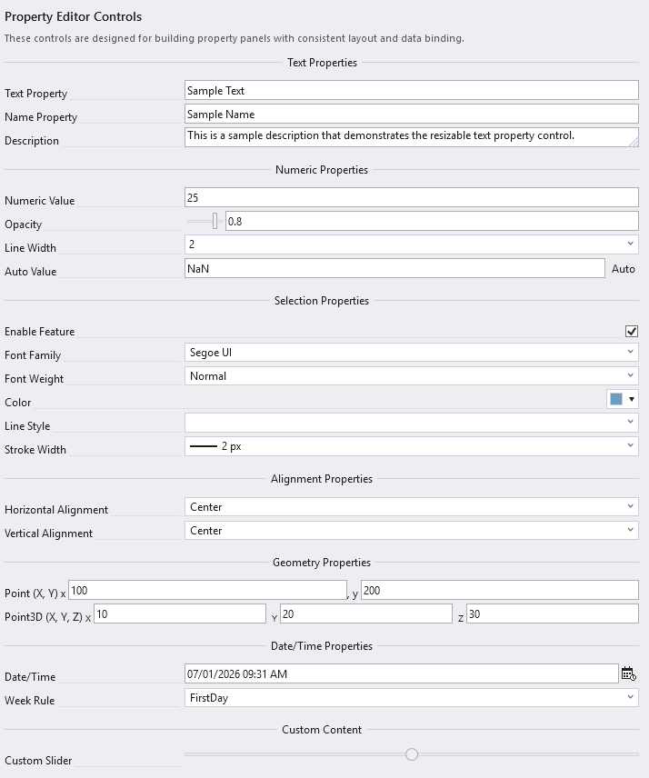
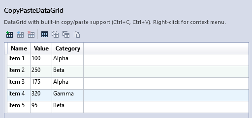

# Control Gallery

This gallery outlines the screenshots used to show the visible controls in the WPF Framework demo applications. Blue theme is the default capture style. Light and Dark screenshots are included only where they show theme coverage.

Screenshots belong in `docs/assets/gallery/` using the filenames shown below.

## Contents

- [FrameworkUI](#frameworkui)
  - [Application Shell](#application-shell)
  - [Theme Comparison](#theme-comparison)
  - [Hazard Document](#hazard-document)
- [GenericControls](#genericcontrols)
  - [Input Controls](#input-controls)
  - [Date, Time, and Color](#date-time-and-color)
  - [Property Editors](#property-editors)
  - [Data Grid](#data-grid)
- [NumericControls](#numericcontrols)
  - [Distribution Selector](#distribution-selector)
  - [Uncertain Curve Editor](#uncertain-curve-editor)
  - [Uncertain Table Editor](#uncertain-table-editor)
  - [Curve Editor](#curve-editor)
  - [Probability Ordinates](#probability-ordinates)
  - [Time Series](#time-series)
  - [Bin Definitions](#bin-definitions)
  - [Bivariate CDF](#bivariate-cdf)
- [OxyPlotControls](#oxyplotcontrols)
  - [Plot Toolbar](#plot-toolbar)
  - [Plot Properties](#plot-properties)
  - [Series Selector](#series-selector)
- [DatabaseControls](#databasecontrols)
  - [Table Viewer](#table-viewer)
- [ExpressionParserControls](#expressionparsercontrols)
  - [Calculator Control](#calculator-control)
- [DAGControls](#dagcontrols)
  - [Flow Graph Canvas](#flow-graph-canvas)

## FrameworkUI

Demo source: `src/FrameworkUI.Demo/`

### Application Shell

Application shell with project explorer, docking documents, properties, messages, menus, and toolbar.

See: [Architecture](architecture.md), [Themes](themes.md)

### Theme Comparison

Light theme capture of the same shell layout.

Dark theme capture of the same shell layout.

See: [Themes](themes.md)

### Hazard Document

Document view with an OxyPlot chart, vertical plot toolbar, tabular results, and properties workflow.

See: [OxyPlot Controls](oxyplot-controls.md), [Generic Controls](generic-controls.md)

## GenericControls

Demo source: `src/GenericControls.Demo/`

### Input Controls

Name, numeric, slider, resizable text, grid length, and thickness input controls.

See: [Generic Controls](generic-controls.md)

### Date, Time, and Color

Clock, date/time inputs, color picker, and color picker popup.

See: [Generic Controls](generic-controls.md)

### Property Editors

Property editors for text, numbers, booleans, fonts, colors, lines, alignment, points, dates, and custom content.

See: [Generic Controls](generic-controls.md)

### Data Grid

Data grid toolbar and copy/paste data grid controls for editable tabular workflows.

See: [Generic Controls](generic-controls.md)

## NumericControls

Demo source: `src/NumericControls.Demo/`

### Distribution Selector

Distribution selector with fitting options, parameters, plot, and statistics.

See: [Numeric Controls](numeric-controls.md)

### Uncertain Curve Editor

Curve editor for ordered data with uncertainty.

See: [Numeric Controls](numeric-controls.md)

### Uncertain Table Editor

Table editor for uncertain ordered data.

See: [Numeric Controls](numeric-controls.md)

### Curve Editor

Curve editor for ordered numeric data.

See: [Numeric Controls](numeric-controls.md)

### Probability Ordinates

Editor for probability ordinate sets.

See: [Numeric Controls](numeric-controls.md)

### Time Series

Time series table with selectable sample data sets.

See: [Numeric Controls](numeric-controls.md)

### Bin Definitions

Editor for bin definitions used by numeric workflows.

See: [Numeric Controls](numeric-controls.md)

### Bivariate CDF

Bivariate empirical CDF control.

See: [Numeric Controls](numeric-controls.md)

## OxyPlotControls

Demo source: `src/OxyPlotControls.Demo/`

### Plot Toolbar

Plot view with vertical toolbar for pan, zoom, annotation, export, and properties.

See: [OxyPlot Controls](oxyplot-controls.md)

### Plot Properties

Properties panel for axes, series, annotations, legends, and layout settings.

See: [OxyPlot Controls](oxyplot-controls.md)

### Series Selector

Series selector for line, scatter, histogram, bar, box plot, area, heat map, pie, and large-data examples.

See: [OxyPlot Controls](oxyplot-controls.md)

## DatabaseControls

Demo source: `src/DatabaseControls.Demo/`

### Table Viewer

Table viewer with file/table selection, editable cells, row/column/cell selection, autofit columns, and field calculator access.

See: [Database Controls](database-controls.md)

## ExpressionParserControls

Demo source: `src/ExpressionParserControls.Demo/`

### Calculator Control

Calculator control with expression editor, operator buttons, function browser, expression builder, and result output.

See: [Database Controls](database-controls.md)

## DAGControls

Demo source: `src/DAG.Demo/`

### Flow Graph Canvas

Flow graph canvas with nodes, connectors, add-node workflow, and connection feedback.

See: [DAG Controls](dag-controls.md)
