# Control Gallery

Explore the application shell, editors, plotting tools, and graph controls in the WPF Framework demo applications. Each screenshot shows a running demo with its sample data or a small synthetic example.

Most controls are shown in the Blue theme. The shell comparison also shows Light and Dark; property editors and the expression calculator use Light, and the flow graph uses its demo's default appearance.

## Contents

- [FrameworkUI](#frameworkui)
  - [Application Shell](#application-shell)
  - [Theme Comparison](#theme-comparison)
  - [Hazard Document](#hazard-document)
- [GenericControls](#genericcontrols)
  - [Input Controls](#input-controls)
  - [Date, Time, and Color](#date-time-and-color)
  - [Property Editors](#property-editors)
  - [Data Grid](#data-grid)
- [NumericControls](#numericcontrols)
  - [Distribution Selector](#distribution-selector)
  - [Uncertain Curve Editor](#uncertain-curve-editor)
  - [Uncertain Table Editor](#uncertain-table-editor)
  - [Curve Editor](#curve-editor)
  - [Probability Ordinates](#probability-ordinates)
  - [Time Series](#time-series)
  - [Bin Definitions](#bin-definitions)
  - [Bivariate CDF](#bivariate-cdf)
- [OxyPlotControls](#oxyplotcontrols)
  - [Plot Toolbar](#plot-toolbar)
  - [Plot Properties](#plot-properties)
  - [Series Selector](#series-selector)
- [DatabaseControls](#databasecontrols)
  - [Table Viewer](#table-viewer)
- [ExpressionParserControls](#expressionparsercontrols)
  - [Calculator Control](#calculator-control)
- [DAGControls](#dagcontrols)
  - [Flow Graph Canvas](#flow-graph-canvas)

## FrameworkUI

Demo source: `src/FrameworkUI.Demo/`

### Application Shell

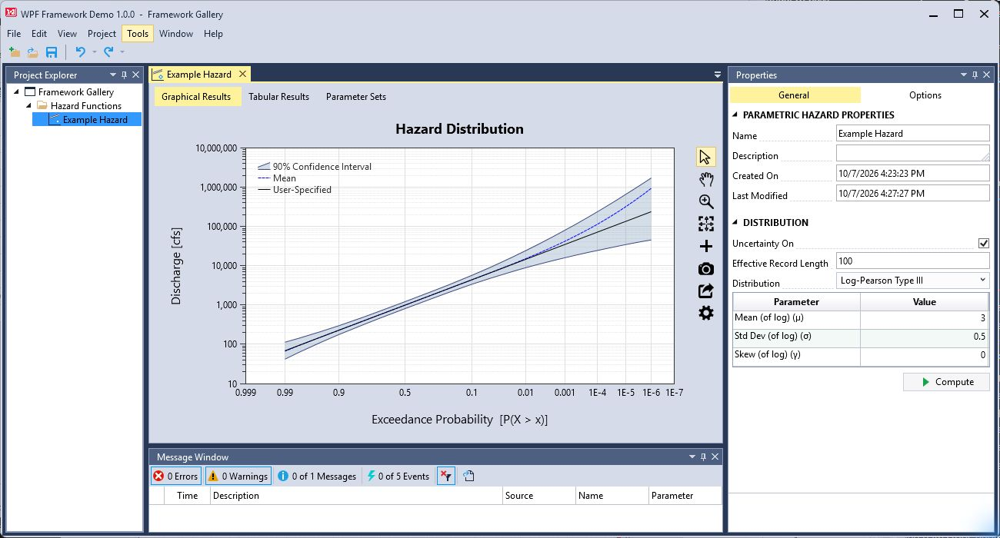

Application shell with project explorer, docking documents, properties, messages, menus, and toolbar.

See: [Architecture](architecture.md), [Themes](themes.md)

### Theme Comparison

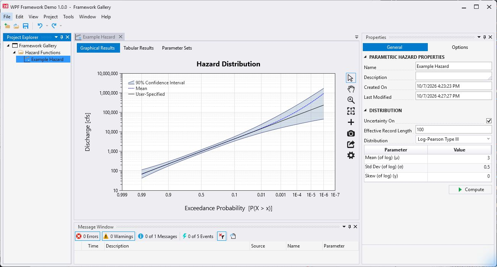

Light theme capture of the same shell layout.

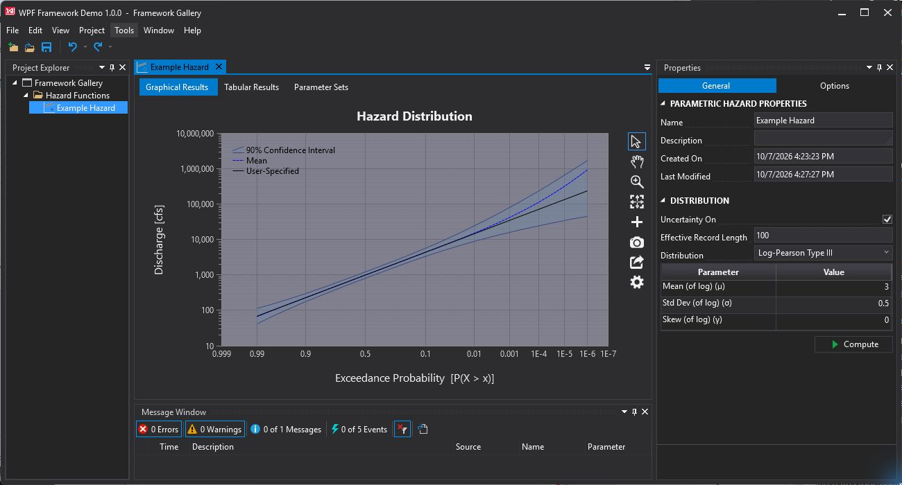

Dark theme capture of the same shell layout.

See: [Themes](themes.md)

### Hazard Document

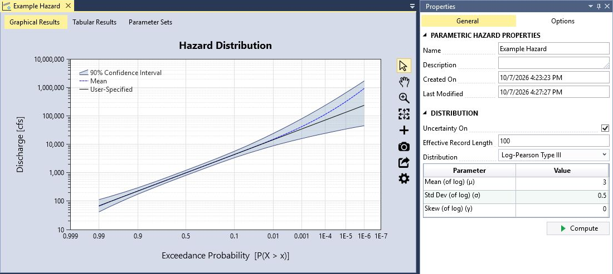

Hazard document with an OxyPlot chart, vertical plot toolbar, and editable properties. Separate document tabs provide tabular results and parameter sets.

See: [OxyPlot Controls](oxyplot-controls.md), [Generic Controls](generic-controls.md)

## GenericControls

Demo source: `src/GenericControls.Demo/`

### Input Controls

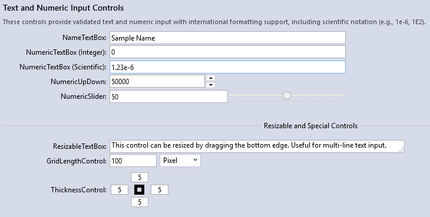

Name, numeric, slider, resizable text, grid length, and thickness input controls.

See: [Generic Controls](generic-controls.md)

### Date, Time, and Color

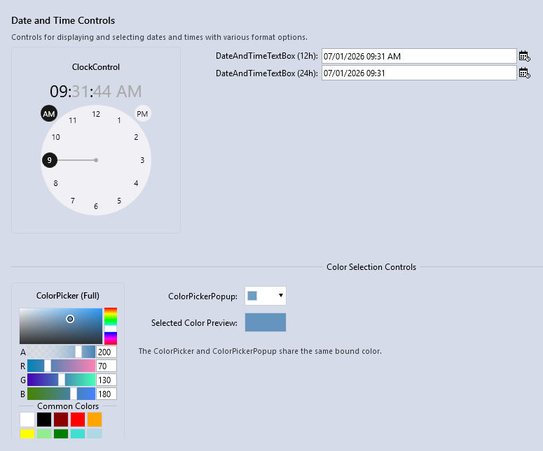

Clock, date/time inputs, color picker, and color picker popup.

See: [Generic Controls](generic-controls.md)

### Property Editors

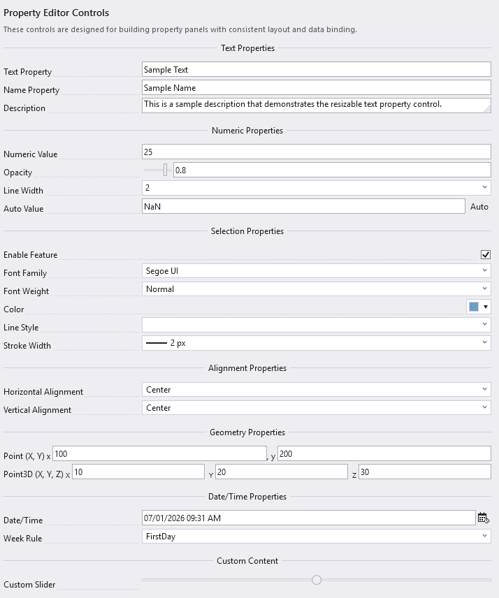

Property editors for text, numbers, booleans, fonts, colors, lines, alignment, points, dates, and custom content.

See: [Generic Controls](generic-controls.md)

### Data Grid

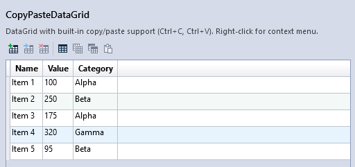

Data grid toolbar and copy/paste data grid controls for editable tabular workflows.

See: [Generic Controls](generic-controls.md)

## NumericControls

Demo source: `src/NumericControls.Demo/`

### Distribution Selector

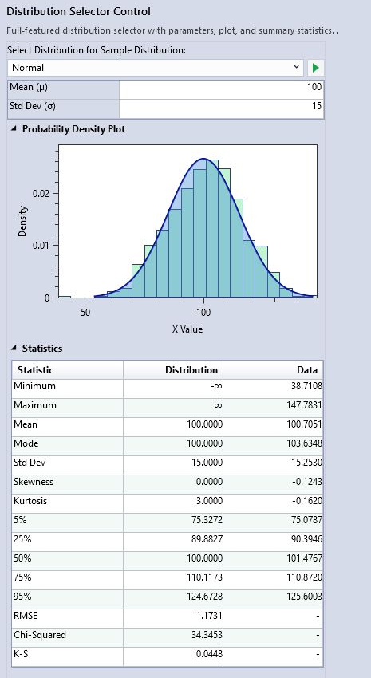

Normal distribution selector with parameters, a density plot and sample histogram, and summary statistics.

See: [Numeric Controls](numeric-controls.md)

### Uncertain Curve Editor

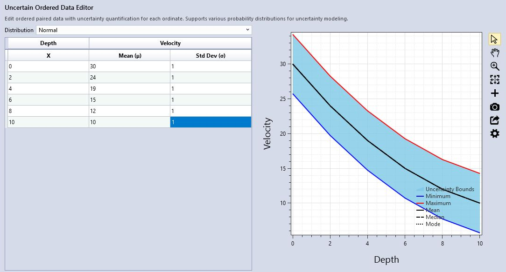

Curve editor for ordered data with uncertainty. This illustrative example uses Normal distributions at six ordinates, with a standard deviation of 1 at each ordinate.

See: [Numeric Controls](numeric-controls.md)

### Uncertain Table Editor

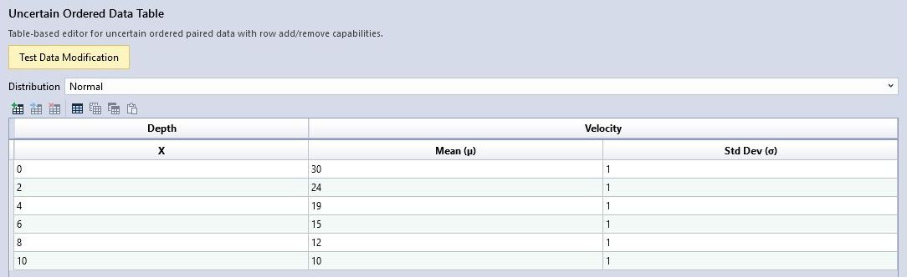

Table editor showing the same six illustrative Normal distributions as the uncertain curve example.

See: [Numeric Controls](numeric-controls.md)

### Curve Editor

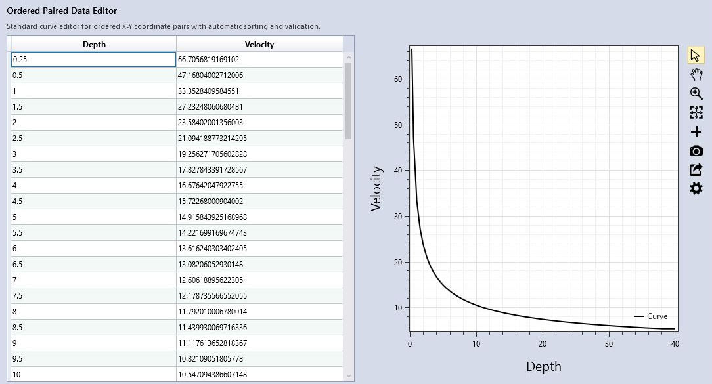

Curve editor for ordered numeric data.

See: [Numeric Controls](numeric-controls.md)

### Probability Ordinates

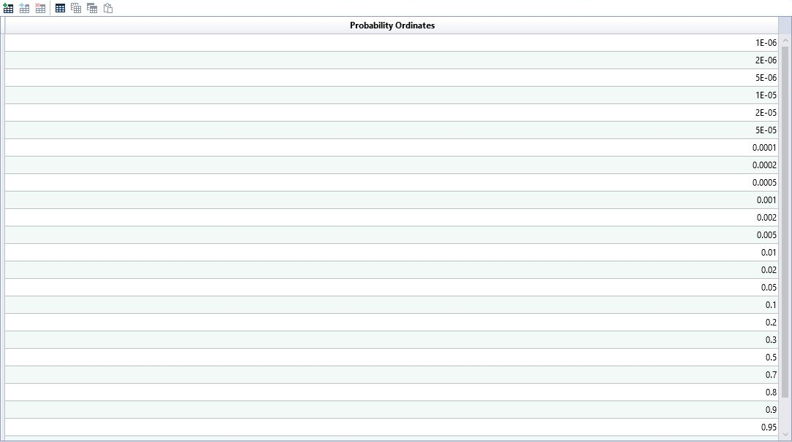

Editor for probability ordinate sets.

See: [Numeric Controls](numeric-controls.md)

### Time Series

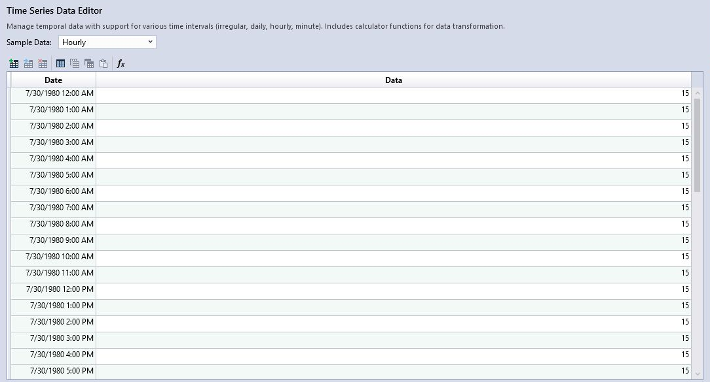

Time series table showing the demo's built-in hourly example, with a constant value of 15 beginning July 30, 1980.

See: [Numeric Controls](numeric-controls.md)

### Bin Definitions

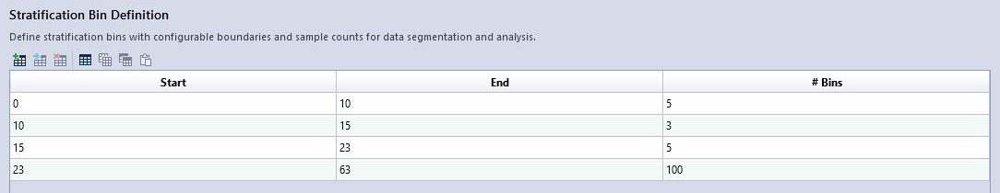

Editor for bin definitions used by numeric workflows.

See: [Numeric Controls](numeric-controls.md)

### Bivariate CDF

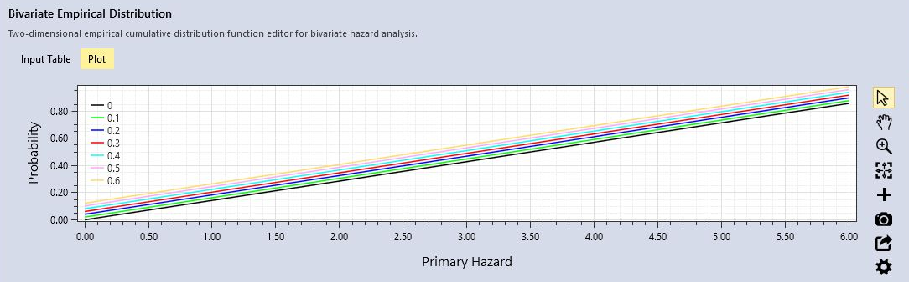

Bivariate empirical CDF control with its Plot tab selected.

See: [Numeric Controls](numeric-controls.md)

## OxyPlotControls

Demo source: `src/OxyPlotControls.Demo/`

### Plot Toolbar

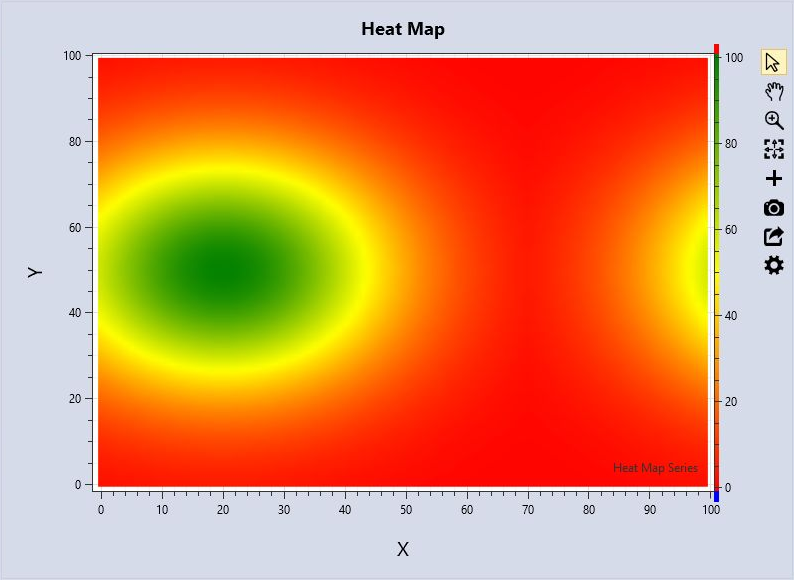

Heat map example with a vertical toolbar for pan, zoom, annotation, export, and properties.

See: [OxyPlot Controls](oxyplot-controls.md)

### Plot Properties

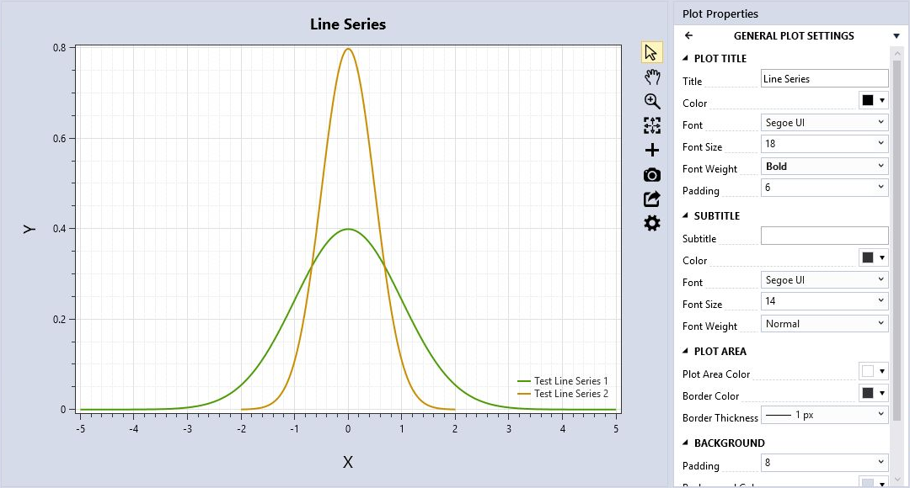

Line-series example beside the properties panel, showing plot title, typography, plot area, and background settings.

See: [OxyPlot Controls](oxyplot-controls.md)

### Series Selector

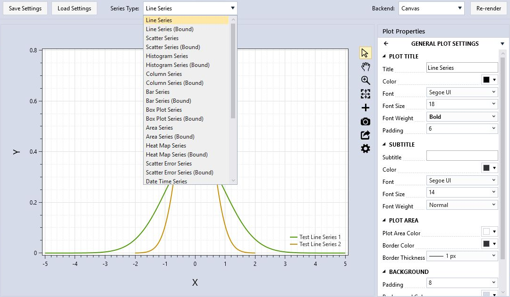

Series selector for line, scatter, histogram, bar, box plot, area, heat map, pie, and large-data examples.

See: [OxyPlot Controls](oxyplot-controls.md)

## DatabaseControls

Demo source: `src/DatabaseControls.Demo/`

### Table Viewer

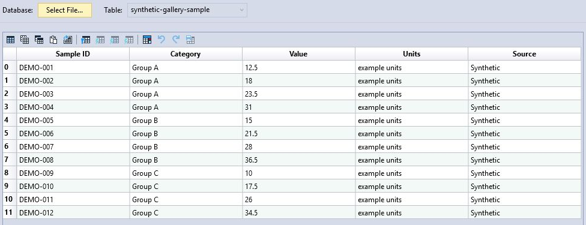

Table viewer displaying the [synthetic sample CSV](assets/gallery/samples/synthetic-gallery-sample.csv), with file/table selection, editable cells, row/column/cell selection, autofit columns, and field calculator access.

See: [Database Controls](database-controls.md)

## ExpressionParserControls

Demo source: `src/ExpressionParserControls.Demo/`

### Calculator Control

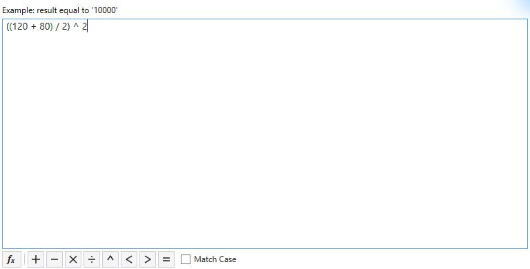

Calculator control with an expression editor, operator buttons, case sensitivity option, and evaluated result output.

See: [Database Controls](database-controls.md)

## DAGControls

Demo source: `src/DAG.Demo/`

### Flow Graph Canvas

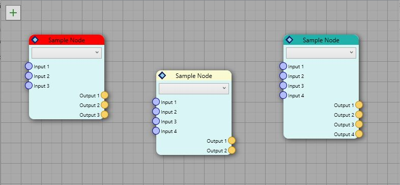

Flow graph canvas with sample nodes and their input and output connectors. The demo supports adding nodes from the canvas context menu and arranging them on the grid.

See: [DAG Controls](dag-controls.md)
